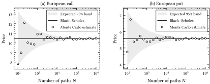
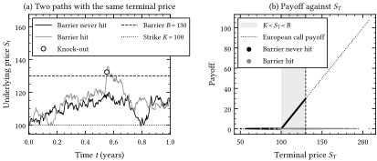

# Monte Carlo Option Pricer

A Monte Carlo pricer for European, Asian and barrier options in Python, validated against closed-form results.

**[Read the report (PDF, 9 pages)](report/option_pricer_report.pdf)**: model, validation and results.

Federico Di Candia · 2026

## What it does

- Simulates the underlying as a geometric Brownian motion under the risk-neutral measure, exactly on a time grid.
- Prices European calls and puts, arithmetic Asian options and discretely monitored barrier options (knock-in and knock-out, up and down).
- Reports every price with its standard error and 95% confidence interval.
- Estimates delta, gamma and vega by central finite differences with common random numbers.

## How it was validated

Every check is statistical: agreement is measured in standard errors (z-scores).

| Check | Result |
|---|---|
| European prices against Black–Scholes, 12 scenarios | largest deviation 2.20 standard errors |
| The one scenario outside its 95% interval, repeated 500 times | z-scores with mean −0.02, standard deviation 1.03, 94.8% within ±1.96 |
| Geometric Asian call against its exact formula (2 000 000 paths) | z = +1.36 |
| Up-and-out call against the corrected closed-form price (2 000 000 paths) | z = −0.52 |
| Greeks of the European call against Black–Scholes | largest deviation 1.26 standard errors |
| Common random numbers against independent seeds | standard error of gamma 338 times smaller |





## Notebooks

Step-by-step presentations of the same material (in Italian). They open on Google Colab with one click; a Google account is needed to run them there.

| Notebook | Content | |
|---|---|---|
| [01 · European options](notebooks/01_european_monte_carlo.ipynb) | Simulation, pricing, standard error, convergence | [](https://colab.research.google.com/github/FedeDiCandia/monte-carlo-option-pricer/blob/main/notebooks/01_european_monte_carlo.ipynb) |
| [02 · Black–Scholes validation](notebooks/02_black_scholes_validation.ipynb) | Closed-form prices, scenario tests, convergence | [](https://colab.research.google.com/github/FedeDiCandia/monte-carlo-option-pricer/blob/main/notebooks/02_black_scholes_validation.ipynb) |
| [03 · Exotic options and Greeks](notebooks/03_exotics_and_greeks.ipynb) | Asian and barrier options, finite-difference Greeks | [](https://colab.research.google.com/github/FedeDiCandia/monte-carlo-option-pricer/blob/main/notebooks/03_exotics_and_greeks.ipynb) |

## Quick start

```bash
git clone https://github.com/FedeDiCandia/monte-carlo-option-pricer.git
cd monte-carlo-option-pricer
pip install -r requirements.txt
```

```python
from option_pricer import GBM, BarrierOption, price_monte_carlo

model = GBM(S0=100, r=0.05, sigma=0.20)
option = BarrierOption(K=100, T=1, barrier=130, kind="call", direction="up", knock="out")
result = price_monte_carlo(model, option, n_paths=100_000, n_steps=252, seed=42)
print(result.price, result.std_error)
```

## Project structure

```
option_pricer/      Python package
  models.py           geometric Brownian motion
  instruments.py      European, Asian and barrier payoffs
  monte_carlo.py      pricing engine: estimate, standard error, confidence interval
  black_scholes.py    closed-form prices and Greeks
  validation.py       Monte Carlo against Black–Scholes
  greeks.py           finite-difference Greeks with common random numbers
  plotting.py         figure style
notebooks/          three notebooks, runnable locally or on Colab
report/             report source (Typst), the script that generates its numbers and figures, and the PDF
```

The pricing engine never inspects the type of contract: models describe how the underlying moves, instruments describe what a contract pays on a simulated path, and new contracts are added as new instrument classes.

## Rebuilding the report

Every number and figure in the report is generated from the package with fixed random seeds:

```bash
python report/build_assets.py
typst compile --root . report/report.typ report/option_pricer_report.pdf
```

The second command needs [Typst](https://typst.app).

## License and provenance

The code is released under the MIT License. The fonts in `report/fonts` are distributed under the SIL Open Font License.

The code and the report were developed in working sessions with an AI language model (Claude Opus 5, Anthropic) under the author's direction; the report describes how the results were checked.
